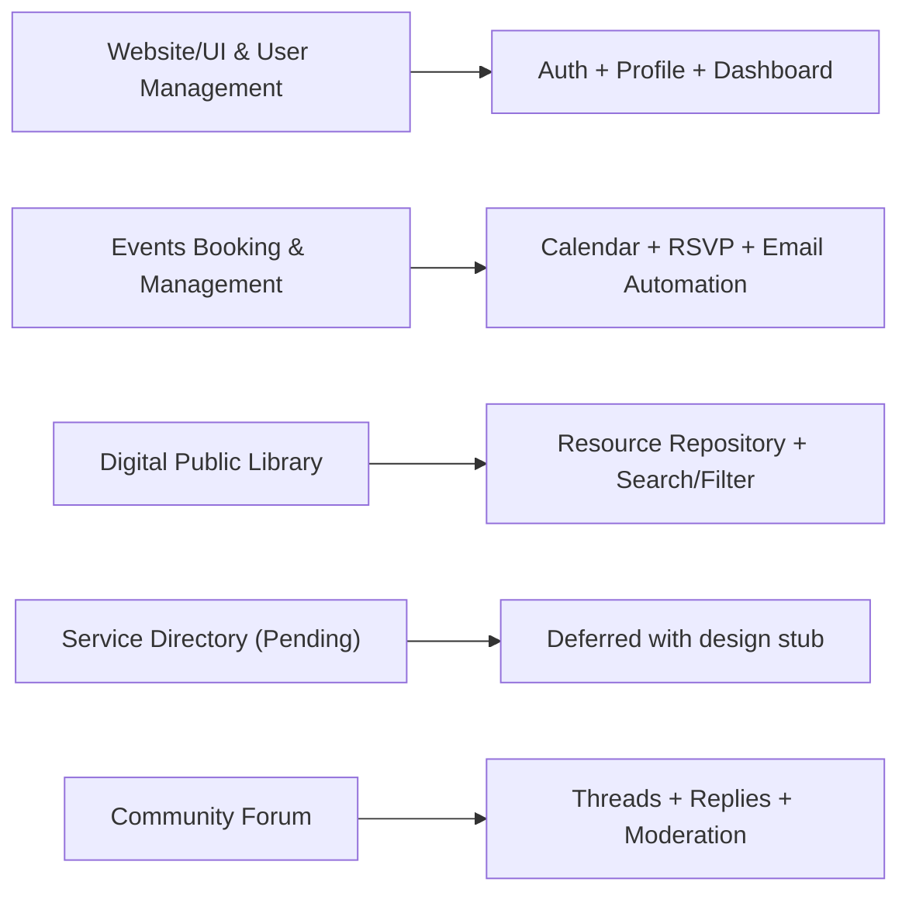
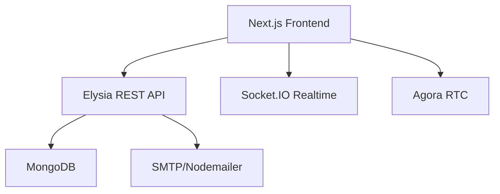
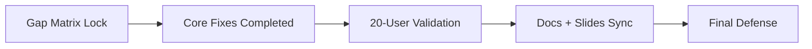

# Requirement Presentation Outline - The Gathering

## Slide 1: Title
- The Gathering - Virtual Co-Working Space MVP
- Team, advisor, date

## Slide 2: Problem Statement (from Technical Brief)
- Remote workers need community, productivity support, and shared resources.
- Existing tools are fragmented across chat, calls, events, and content.
- Target: MVP for 30-50 private beta users.

## Slide 3: Solution Vision
- One integrated virtual co-working platform:
  - Spatial environment (PixiJS)
  - Real-time communication (Socket.IO + Agora)
  - Events, library, forum, and user management

## Slide 4: MVP Requirement Map

## Slide 5: Architecture (How We Solve It)

## Slide 6: Requirement 1 - Website/UI & Management
- Implemented: sign-up/login/OTP/Google auth, profile, dashboard.
- Evidence: working routes and protected APIs.

## Slide 7: Requirement 2 - Events Booking & Management
- Implemented: event CRUD, RSVP, reminder scheduler, booking confirmation emails.
- Added in this completion cycle:
  - Reminder telemetry and retry-safe behavior
  - Hosting metadata (`roomIndex`, `channelKey`, `breakoutRooms`)

## Slide 8: Requirement 3 - Public Library
- Implemented: resource repository with search/filter and content types.
- Explain user flow from discovery to access.

## Slide 9: Requirement 4 - Service Directory
- Status: Deferred pending client approval.
- Present design stub and integration plan after approval.

## Slide 10: Requirement 5 - Community Forum
- Implemented: create thread, reply, pagination.
- Hardened moderation:
  - role-aware moderation in API response (`canDelete`)
  - UI moderator visibility and controls.

## Slide 11: Validation and MVP Readiness
- Show `doc/MVP_Gap_Matrix.md` and `doc/MVP_Readiness_Report.md`.
- Present pass/partial matrix and risk controls.

## Slide 12: 20-User Scenario Plan
- Explain test protocol, metrics, expected result, and fallback if instability appears.

## Slide 13: Team Responsibility Mapping
- Pham Nguyen Thien Loc (leader): planning, sprint coordination, final narrative.
- Le Tan Dat: auth and avatar customization.
- Le Thoi Duy: calendar and event feature implementation.
- Banh Van Tran Phat: real-time core + integration + remaining modules.

## Slide 14: Roadmap to Final Defense (04/05/2026)

## Slide 15: Demo Flow
- Login -> Enter realm -> Create/book event -> Open forum/library -> show moderation and reminders.

## Slide 16: Closing
- Re-state impact: productivity + community + shared learning in one platform.
- Ask for questions.
